# Docker-Compose-Moodle

Para poder crear el archivo docker-compose.yml accedemos a la siguiente liga y copiar el ejemplo del archivo con extensión .yml e la siguiente liga: https://github.com/bitnami/containers/blob/main/bitnami/moodle/docker-compose.yml

Se mantiene la configuración del docker-compose.yml

    version: '2'
    services:
    mariadb:
        image: docker.io/bitnami/mariadb:10.6
        environment:
        # ALLOW_EMPTY_PASSWORD is recommended only for development.
        - ALLOW_EMPTY_PASSWORD=yes
        - MARIADB_USER=bn_moodle
        - MARIADB_DATABASE=bitnami_moodle
        - MARIADB_CHARACTER_SET=utf8mb4
        - MARIADB_COLLATE=utf8mb4_unicode_ci
        volumes:
        - 'mariadb_data:/bitnami/mariadb'
    moodle:
        image: docker.io/bitnami/moodle:4.2
        ports:
        - '80:8080'
        - '443:8443'
        environment:
        - MOODLE_DATABASE_HOST=mariadb
        - MOODLE_DATABASE_PORT_NUMBER=3306
        - MOODLE_DATABASE_USER=bn_moodle
        - MOODLE_DATABASE_NAME=bitnami_moodle
        # ALLOW_EMPTY_PASSWORD is recommended only for development.
        - ALLOW_EMPTY_PASSWORD=yes
        volumes:
        - 'moodle_data:/bitnami/moodle'
        - 'moodledata_data:/bitnami/moodledata'
        depends_on:
        - mariadb
    volumes:
    mariadb_data:
        driver: local
    moodle_data:
        driver: local
    moodledata_data:
        driver: local

## Correr localmente usando docker

Clonar el repositorio al directorio local de instalación

    git clone "liga del repositorio"

Para correr los contenedores se debe acceder a la carpeta donde se encuentra el archivo docker-compose.yml

    $docker compose up -d

Para detener los contenedores

    $docker compose down

Ejemplo al momento de levantar el contenedor

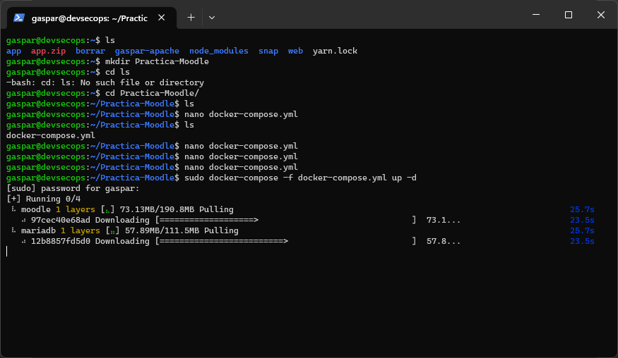
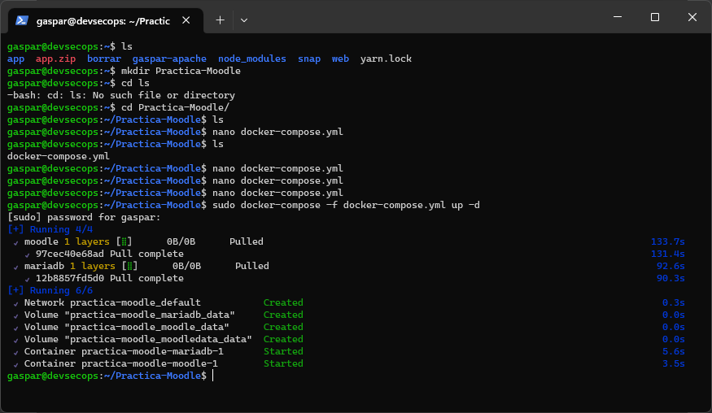

Al finalizar con el comando docker ps podremos ver los contenedores corriendo

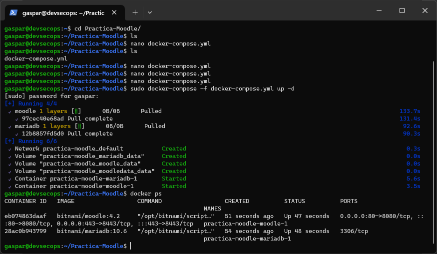
## Correr moodle y Configurar

Acceder al navegador con la direccion que tiene la maquina virtual, seguido el puerto a cual ha sido alojado el contenedor

    http://localhost:80/

    Username: user

    Password: bitnami

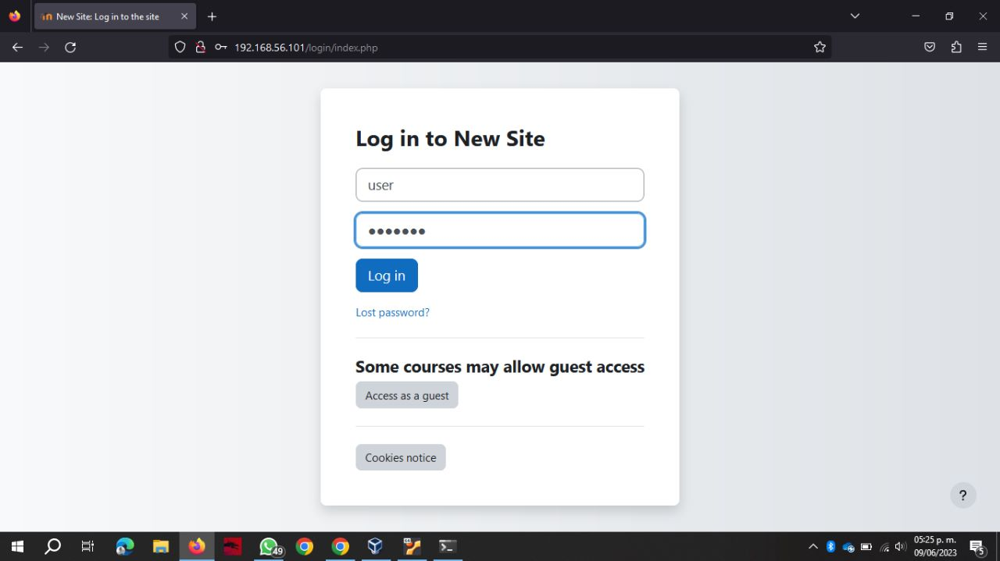

## Acceder a moodle con el usuario y contraseña que se creó previamente

    Username: user

    Password: bitnami

Al acceder con las credenciales anteriores podemos observar lo siguiente
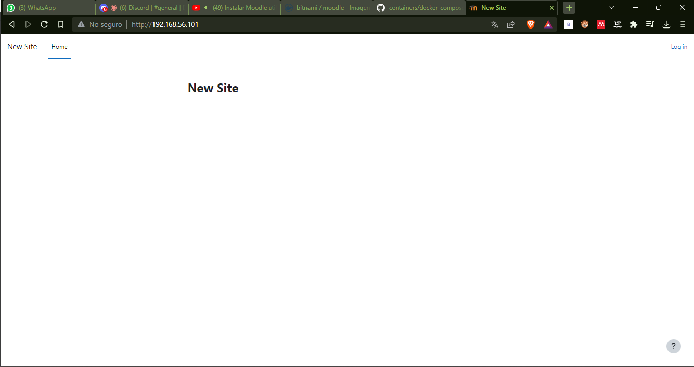

Se agregan los usuarios en la siguiente ruta: Site administration/User/Add a new user

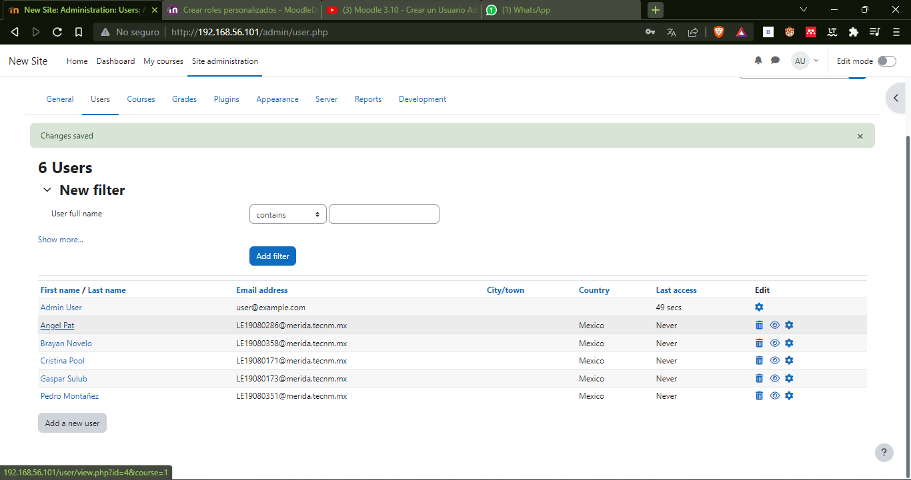
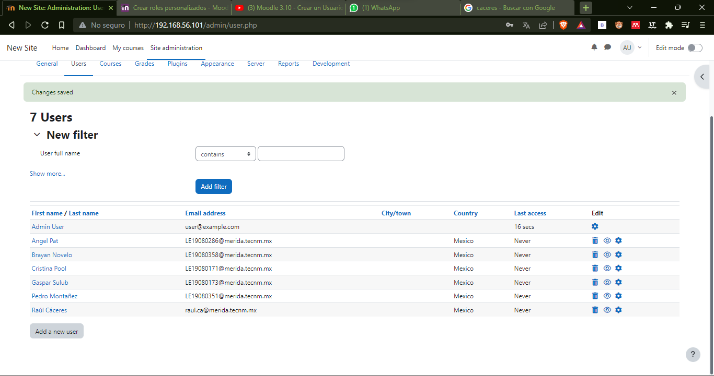

Agregar usuario como administrador en la siguiente ruta: Site administration/User/Pwrmissions/Assign system roles

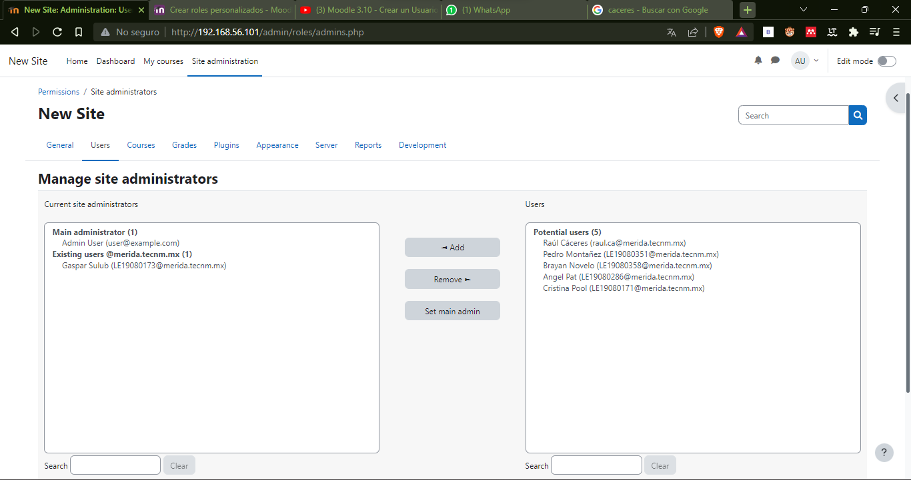

Se crea un nuevo curso

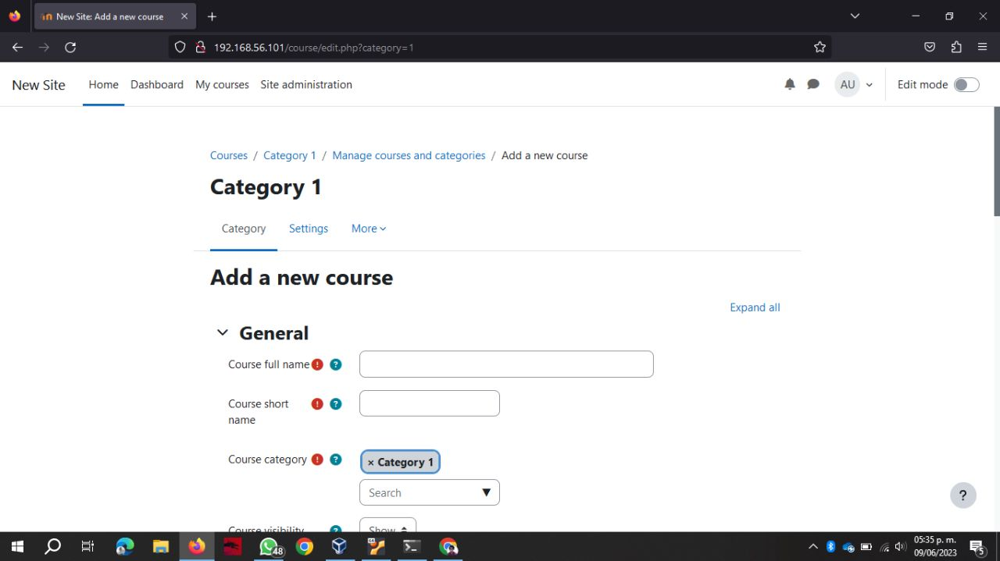

Se agregan los estudiantes y maestros

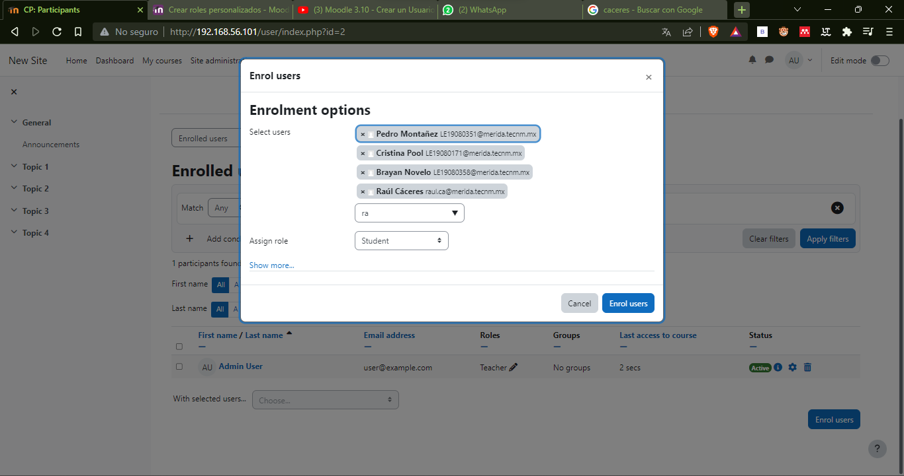

En la siguientes imagenes podemos observar todos los alumnos y maestros creados
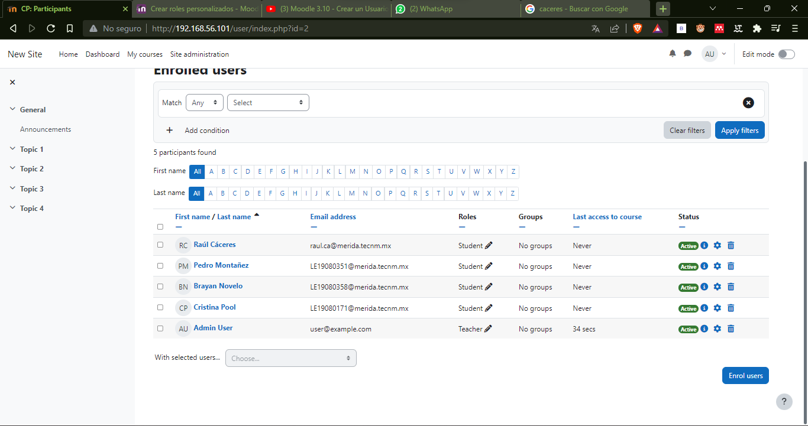
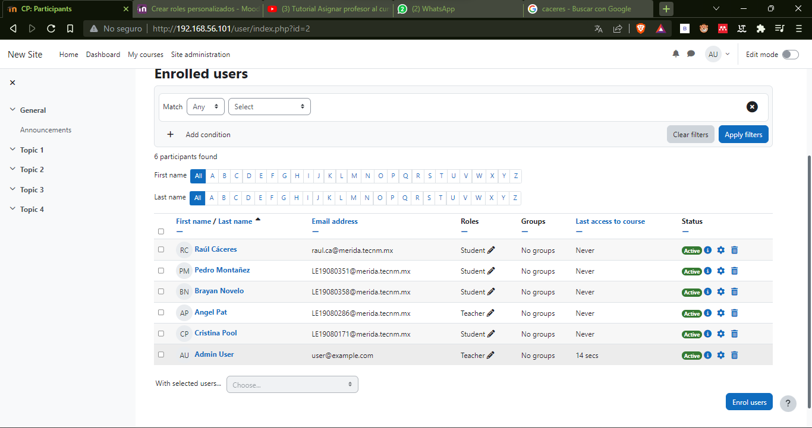